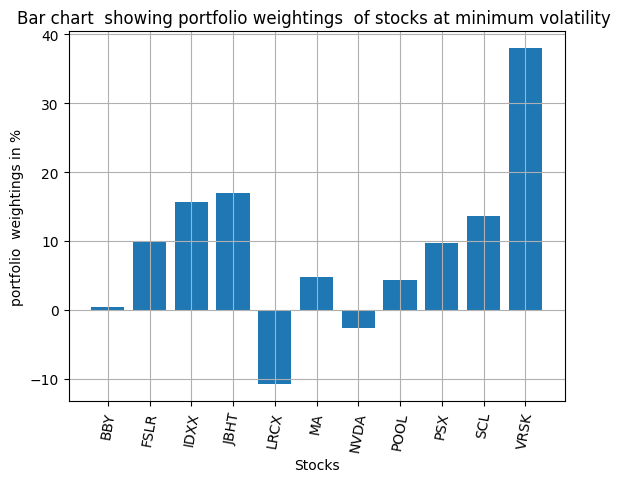
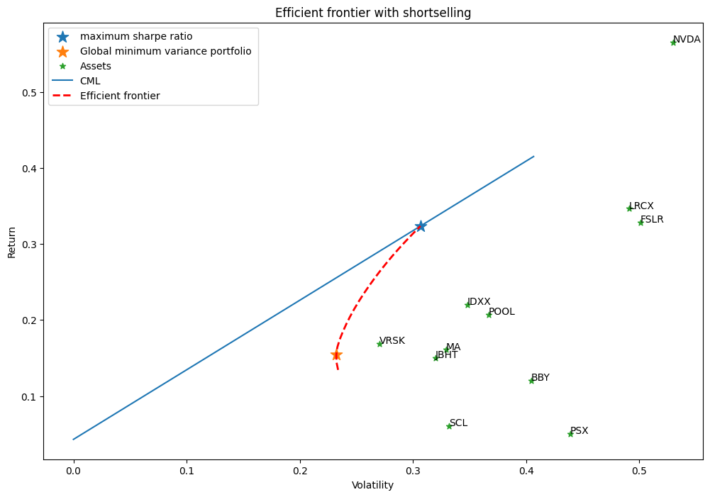

# Portfolio Optimization 1

### Project brief

This project is about portfolio management using the Modern Portfolio Theory (MPT) also known as the Mean - Variance method, 11 stocks which are :
    'NVDA':'Nvidia',
    'PSX':'ConocoPhillips',
    'BBY':'Best Buy',
    'LRCX':'Lam Research',
    'IDXX':'Idexx Laboratories',
    'POOL':'Pool',
    'JBHT':'J.B. Hunt Transport Service',
    'VRSK':'Verisk Analytics',
    'SCL':'Stepan',
    'FSLR':'First Solar',
    'MA':'MasterCard' , 

their historical data is downloaded from yahoo finance. Do well to go through the jupyter notebook file, the theory of the concept is also well documented inside the project.

Efficient frontier of the monte carlo simulation of portfolios is shown below

optimization for having shortselling and not shortselling is done 

#### For portfolio optimization with shortselling a visualization of the weightings and efficient frontier are shown below:

#### For portfolio optimization without shortselling a visualization of the weightings and efficient frontier are shown below:

and 
for non-technical readers a simple to open html file is available in the html folder

If you find my simple work interesting you can send me a mail on daimechengr@gmail.com

