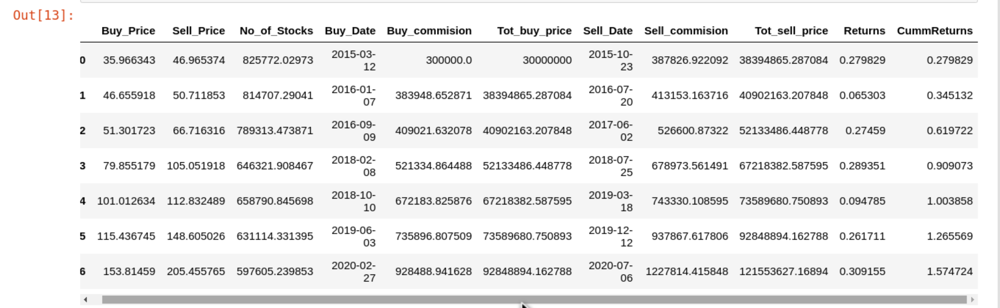

# Algorithmic trading using Bollinger bands and RSI (Relative Strength Index) indicators

### Project brief

This project implements algorithmic trading with bollinger bands and RSI usng python in jupyter notebook,since the two are indicators to determine over-sold and over-bought conditions the data used in the development of the strategy(i.e training) is Microsoft Adjusted close stocks data for the range (2015/01/01--2020/12/31) while it was tested for the range (2021/01/01--2022/12/31). A simple backtesting algorithm was also developed which takes into consideration broker's commission as a percentage of the amount being traded.

The backtest for the development data was carried out with a starting capital of $30,000,000 with a broker's commision of 1%, this resulted in a profit of $91553627.1689 a 305.1788% profit.

The backtest dataframe of the strategy development is shown below

The plot for the test is shown below

The testing period trade was also backtested with a starting capital of $30,000,000 with a broker's commision of 1%, which resulted in a $8248187.949 profit a 27.494% profit

The backtest Dataframe for the test period is shown below:

Facebook and Amazon stocks data will also tested with this strategy.

for non-coders a simple to open html file is available in the html folder

If you find my simple work interesting you can send me a mail on daimechengr@gmail.com

